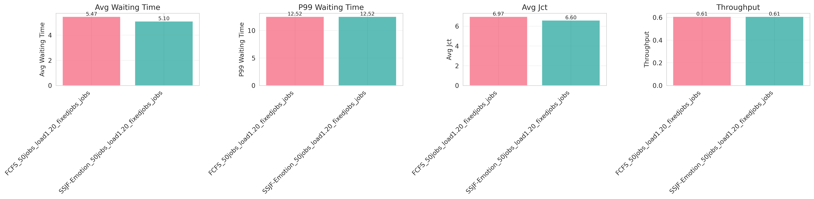
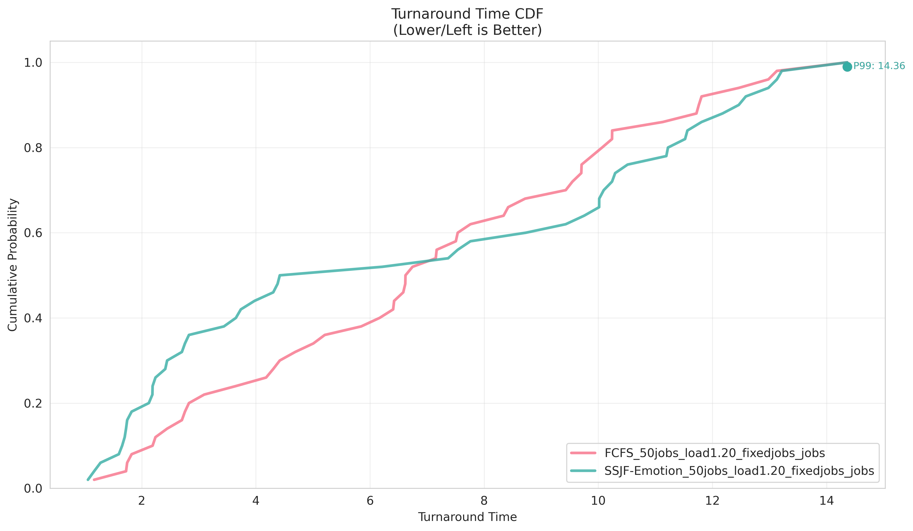
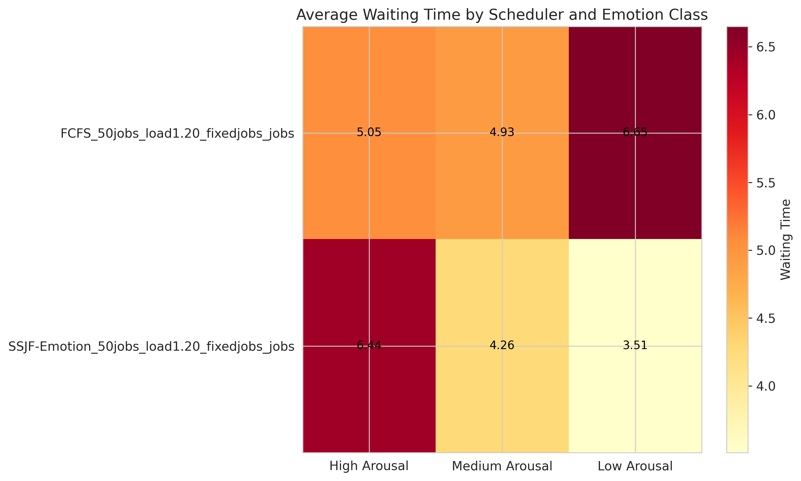

# Emotion-aware LLM Scheduling System

An emotion-aware GPU task scheduling system for LLM inference workloads that integrates real language models with emotion-based scheduling strategies. The system maps user emotions (specifically arousal levels) to predict task characteristics and evaluates different scheduling algorithms for fairness and efficiency.

## Overview

This project explores how emotional context affects LLM inference task scheduling by:

- **Real LLM Integration**: Runs actual HuggingFace models (e.g., Meta-Llama-3-8B-Instruct) generating empathetic responses
- **Emotion-aware Workload**: Uses the EmpatheticDialogues dataset with 32 emotion categories mapped to arousal levels
- **Scheduling Algorithms**: Compares FCFS (baseline) vs SSJF-Emotion (prioritizes predicted shorter tasks)
- **Fairness Analysis**: Evaluates scheduling fairness across emotion categories using comprehensive metrics

## Quick Start

**Run with real LLM (10 tasks):**
```bash
uv run python run_simulation.py --scheduler FCFS --num_jobs 10 --verbose
```

**Run SSJF-Emotion scheduler:**
```bash
uv run python run_simulation.py --scheduler SSJF-Emotion --num_jobs 50
```

**Compare schedulers (with reproducible jobs):**
```bash
# Run FCFS (generates and saves job configurations)
uv run python run_simulation.py --scheduler FCFS --num_jobs 100 --random_seed 42 --output_dir results/llm_runs

# Run SSJF-Emotion (uses same job configurations and cached responses for fair comparison)
uv run python run_simulation.py --scheduler SSJF-Emotion --num_jobs 100 --output_dir results/llm_runs
```

## Table of Contents

- [Installation](#installation)
- [System Architecture](#system-architecture)
- [Key Formulas](#key-formulas)
- [Configuration](#configuration)
- [Usage](#usage)
- [Evaluation Metrics](#evaluation-metrics)
- [Results](#results)
- [Output Files](#output-files)
- [Troubleshooting](#troubleshooting)
- [Research Directions](#research-directions)
- [References](#references)

---

## Installation

This project uses [uv](https://github.com/astral-sh/uv) for fast and reliable Python package management.

### 1. Install uv

```bash
# On macOS and Linux
curl -LsSf https://astral.sh/uv/install.sh | sh

# On Windows
powershell -c "irm https://astral.sh/uv/install.ps1 | iex"
```

### 2. Setup Project Environment

```bash
# Clone the repository
cd Emotion-aware-LLM-scheduling

# Sync dependencies (creates virtual environment automatically)
uv sync
```

### 3. Additional Setup for LLM Integration

**HuggingFace Authentication** (required for gated models like LLaMA):
```bash
# Install HuggingFace CLI
uv pip install huggingface-hub

# Login with your token
uv run huggingface-cli login
# Get token from: https://huggingface.co/settings/tokens
```

**Accept model license** (for Llama):
1. Go to https://huggingface.co/meta-llama/Meta-Llama-3-8B-Instruct
2. Click "Agree and access repository"
3. Fill out the form

**Download and setup dataset** (EmpatheticDialogues):

1. Download the dataset from Kaggle:
```bash
# Download the dataset using Kaggle API
curl -L -o ~/Downloads/empathetic-dialogues-facebook-ai.zip \
  https://www.kaggle.com/api/v1/datasets/download/atharvjairath/empathetic-dialogues-facebook-ai
```

2. Extract and setup:
```bash
# Unzip the downloaded file
unzip ~/Downloads/empathetic-dialogues-facebook-ai.zip -d ~/Downloads/empathetic-dialogues

# Create dataset directory in project root
mkdir -p dataset

# Copy and rename the files
cp ~/Downloads/empathetic-dialogues/train.csv dataset/train.csv
cp ~/Downloads/empathetic-dialogues/valid.csv dataset/valid.csv
cp ~/Downloads/empathetic-dialogues/test.csv dataset/test.csv
```

3. Verify dataset:
```bash
ls -la dataset/
# Expected: train.csv, valid.csv, test.csv
```

---

## System Architecture

### Project Structure

```
Emotion-aware-LLM-scheduling/
├── run_simulation.py           # Main entry point
├── pyproject.toml              # uv project configuration
├── dataset/                    # EmpatheticDialogues dataset
│   ├── train.csv
│   ├── valid.csv
│   └── test.csv
├── model-serving/              # Main package (refactored)
│   ├── simulator/              # Scheduling simulator package
│   │   ├── cli.py             # CLI entry & argument parsing
│   │   ├── experiment.py      # High-level experiment orchestration
│   │   ├── loop.py            # Core scheduling loop
│   │   ├── job_config.py      # Job configuration load/save helpers
│   │   ├── llm_runtime.py     # LLM initialization & cache handling
│   │   └── reporting.py       # Metrics printing & result persistence
│   ├── config/                 # Configuration modules
│   │   ├── __init__.py        # Config entry point (re-exports loader helpers)
│   │   ├── default.yaml       # YAML configuration (single source of truth)
│   │   └── config_loader.py   # YAML loader + env/CLI overrides
│   ├── core/                   # Core scheduling logic
│   │   ├── emotion.py         # Emotion sampling & mapping
│   │   ├── job.py             # Job data structure
│   │   ├── scheduler_base.py  # Base scheduler & FCFS
│   │   └── ssjf_emotion.py    # SSJF-Emotion scheduler
│   ├── llm/                    # LLM integration
│   │   ├── engine.py          # Model loading & generation
│   │   ├── dataset_loader.py  # Dataset loading
│   │   ├── prompt_builder.py  # Prompt construction
│   │   ├── response_cache.py  # Response caching
│   │   └── inference_handler.py # LLM orchestration
│   ├── workload/               # Workload generation
│   │   ├── service_time_mapper.py # Arousal to time mapping
│   │   └── task_generator.py      # Job generation
│   └── analysis/               # Results analysis
│       ├── logger.py          # Logging utilities
│       └── fairness_metrics.py # Fairness calculations
├── analysis/                   # Visualization tools
│   └── plot_emotion_results.py
└── results/                    # Experiment outputs
    ├── llm_runs/              # Experiment results
    └── cache/                 # Response cache
        └── responses.json
```

### Data Flow

```
1. Configuration Loading (config/)
   ↓
2. Emotion Sampling (core/emotion.py)
   - Sample from 32 emotion categories
   - Map emotion → arousal value [-1, 1]
   ↓
3. Task Generation (workload/task_generator.py)
   - Generate arrival times (emotion-adjusted rates)
   - Map arousal → predicted service time
   ↓
4. LLM Initialization (llm/engine.py, llm/inference_handler.py)
   - Load HuggingFace model
   - Load EmpatheticDialogues dataset
   ↓
5. Scheduling (core/scheduler_base.py, core/ssjf_emotion.py)
   - FCFS: First-come-first-served
   - SSJF-Emotion: Shortest predicted service time first
   ↓
6. Job Execution (simulator/experiment.py, simulator/loop.py)
   - Build empathetic prompt (llm/prompt_builder.py)
   - Generate response with real LLM (llm/engine.py)
   - Measure actual execution time
   - Cache responses (llm/response_cache.py)
   ↓
7. Logging & Analysis (analysis/)
   - Calculate performance metrics
   - Compute fairness indices
   - Generate visualizations
```

---

## Key Formulas

### Service Time Mapping
```
S_i = L_0 * (1 + α * a_i)
```
Where:
- `S_i`: Predicted service time for task i
- `L_0`: Base service time (default: 2.0s)
- `α` (alpha): Sensitivity coefficient (default: 0.5, range: 0-1)
- `a_i`: Arousal value for task i (range: [-1, 1])

**Note:** This is the *predicted* service time used for scheduling. Actual service time is measured from real LLM inference.

### System Load
```
ρ = (λ * E[S]) / N
```
Where:
- `ρ` (rho): System utilization/load
- `λ`: Task arrival rate
- `E[S]`: Expected service time
- `N`: Number of GPUs (N=1 in current setup)

---

## Configuration

The system uses a hierarchical YAML-based configuration structure for better organization and maintainability.

### Configuration File: `model-serving/config/default.yaml`

All configuration is centralized in a single YAML file with hierarchical organization:

#### Workload Configuration
```yaml
workload:
  service_time:
    base_service_time: 2.0      # L_0: Base service time (seconds)
    alpha: 0.5                   # α: Arousal impact coefficient (synchronized)
    rho: 1.0                     # ρ: Correlation strength
    min_service_time: 0.1        # Minimum service time bound
    mapping_function: 'linear'   # Service time mapping function

  arrival:
    base_arrival_rate: 2.0       # λ_0: Base arrival rate (tasks/second)

  emotion:
    arousal_noise_std: 0.0       # Arousal noise standard deviation
    enable_emotion_aware: true   # Enable emotion-aware features
```

#### LLM Configuration
```yaml
llm:
  model:
    name: 'meta-llama/Meta-Llama-3-8B-Instruct'
    device_map: 'auto'           # 'auto', 'cuda', 'cpu'
    dtype: 'auto'                # Model data type
    load_in_8bit: false          # 8-bit quantization

  generation:
    max_new_tokens: 1024         # Maximum tokens to generate
    temperature: 0.7             # Sampling temperature
    top_p: 0.9                   # Nucleus sampling threshold
    do_sample: false             # Use sampling vs greedy

  prompt:
    include_emotion_hint: false  # Include emotion in prompt
    max_conversation_turns: 2    # Conversation history length
    emotion_length_control:
      enabled: true              # Enable emotion-aware response length
      base_response_length: 100  # L_0: Base response length (tokens)
      # Note: Uses same alpha from workload.service_time.alpha

  cache:
    use_response_cache: true     # Enable response caching
    cache_dir: 'results/cache'   # Cache directory
    use_saved_job_config: true   # Use saved job configurations

  error_handling:
    max_retries: 2               # Max retries on failure
    skip_on_error: true          # Skip failed jobs vs abort
```

#### Scheduler Configuration
```yaml
scheduler:
  algorithm: 'FCFS'              # 'FCFS' or 'SSJF-Emotion'
  system_load: 0.6               # Target system load (ρ)
  starvation_prevention:
    threshold: .inf              # Starvation threshold (disabled by default)
    coefficient: 3.0             # Starvation coefficient
```

### Key Configuration Feature: Synchronized Alpha

**Important**: The `alpha` parameter is **synchronized** between service time prediction and LLM response length generation:

- **Service Time Formula**: `S_i = L_0 * (1 + α * a_i)` where α = `workload.service_time.alpha`
- **Response Length Formula**: `L_i = L_0 * (1 + α * a_i)` where α = same value

This ensures prediction and execution use the same arousal scaling, preventing mismatches between predicted and actual behavior.

### Configuration Precedence

Configuration values are loaded with the following precedence (lowest to highest):

1. **Default values** in `config/default.yaml`
2. **Environment variables** (e.g., `WORKLOAD_SERVICE_TIME_ALPHA`)
3. **Command-line arguments** (highest priority)

### Environment Variables

Override any configuration using hierarchical environment variables:

```bash
# Workload Configuration
export WORKLOAD_SERVICE_TIME_ALPHA=0.7
export WORKLOAD_SERVICE_TIME_BASE_SERVICE_TIME=3.0

# LLM Configuration
export LLM_MODEL_NAME="mistralai/Mistral-7B-Instruct-v0.2"
export LLM_MODEL_DEVICE_MAP="cpu"
export LLM_GENERATION_MAX_NEW_TOKENS=128

# Scheduler Configuration
export SCHEDULER_ALGORITHM="SSJF-Emotion"
export SCHEDULER_SYSTEM_LOAD=0.8

uv run python run_simulation.py --num_jobs 100
```

**Backward compatibility**: Old environment variables (e.g., `ALPHA_ENV`, `LLM_MODEL_NAME_ENV`) are still supported.

### Command-Line Arguments

All major parameters can be overridden via command-line arguments:

```bash
uv run python run_simulation.py \
  --scheduler SSJF-Emotion \
  --num_jobs 100 \
  --system_load 0.8 \
  --alpha 0.7 \
  --base_service_time 3.0 \
  --model_name "mistralai/Mistral-7B-Instruct-v0.2" \
  --device_map cpu
```

### Configuration Files

The configuration system is now fully YAML-based:
- `config/default.yaml`: Single source of truth for all defaults
- `config/config_loader.py`: Dataclass loader with env/CLI override support

Use:
```python
from config.config_loader import load_config, get_alpha
config = load_config()
```

---

## Usage

### Basic Usage

**Run FCFS scheduler:**
```bash
uv run python run_simulation.py \
  --scheduler FCFS \
  --num_jobs 50 \
  --verbose
```

**Run SSJF-Emotion scheduler:**
```bash
uv run python run_simulation.py \
  --scheduler SSJF-Emotion \
  --num_jobs 50 \
  --verbose
```

### Advanced Options

**Use CPU (if no GPU available):**
```bash
uv run python run_simulation.py \
  --scheduler FCFS \
  --num_jobs 10 \
  --device_map cpu \
  --verbose
```

**Use 8-bit quantization (save memory):**
```bash
uv run python run_simulation.py \
  --scheduler FCFS \
  --num_jobs 20 \
  --load_in_8bit \
  --verbose
```

**Use different model:**
```bash
uv run python run_simulation.py \
  --scheduler FCFS \
  --num_jobs 10 \
  --model_name "mistralai/Mistral-7B-Instruct-v0.2" \
  --verbose
```

**Adjust system parameters:**
```bash
uv run python run_simulation.py \
  --scheduler SSJF-Emotion \
  --num_jobs 100 \
  --system_load 0.8 \
  --alpha 0.7
```

### Comparing Schedulers

For fair comparison, the system ensures both runs use **identical queries** through job configuration caching:

```bash
# First run: FCFS (generates jobs, saves configuration, caches responses)
uv run python run_simulation.py \
  --scheduler FCFS \
  --num_jobs 100 \
  --random_seed 42 \
  --output_dir results/llm_runs/

# Second run: SSJF-Emotion (loads same job configuration, uses cached responses)
uv run python run_simulation.py \
  --scheduler SSJF-Emotion \
  --num_jobs 100 \
  --output_dir results/llm_runs/
```

**How it works:**
1. The first run sets a random seed (optional but recommended) and generates 100 jobs with random emotions and dataset conversations
2. Job configurations (emotion, conversation_index) are saved to `results/cache/job_configs.json`
3. LLM responses are cached to `results/cache/responses.json`
4. The second run automatically loads the saved job configurations, ensuring **identical queries**
5. Both runs use the same prompts, so response caching is maximally effective

**Note:** Without `--random_seed`, jobs are still saved and reused, but won't be reproducible across different machines or after clearing the cache.

### Generating Visualizations

```bash
# Generate comparison plots from results
uv run python analysis/plot_emotion_results.py
```

---

## Evaluation Metrics

### Performance Metrics

- **Average Waiting Time (R̄)**: Mean time jobs wait before execution
- **P99 Tail Latency**: 99th percentile of waiting/completion time
- **Throughput**: Jobs completed per unit time
- **Average Turnaround Time**: Mean time from arrival to completion

### Fairness Metrics

**Jain Fairness Index (J)**:
```
J = (Σx_i)² / (n * Σx_i²)
```
Range: [1/n, 1] where 1 = perfect fairness

**Additional Fairness Metrics**:
- Per-emotion-class statistics (high/medium/low arousal groups)
- Coefficient of Variation (CV): Std deviation / mean
- Max/Min Ratio: Ratio of maximum to minimum class performance

### LLM-specific Metrics

- **Prediction Accuracy**: Compare predicted vs actual execution time
- **Cache Hit Rate**: Percentage of responses served from cache
- **Average Output Token Length**: Mean length of generated responses
- **Error Rate**: Percentage of failed generations

---

## Results

Experimental results comparing FCFS and SSJF-Emotion schedulers on 100 jobs with system load 0.6:

### Scheduler Performance Comparison



Comprehensive comparison of scheduling algorithms across multiple metrics including average waiting time, P99 latency, fairness indices, and throughput. The SSJF-Emotion scheduler demonstrates improved performance by prioritizing tasks with predicted shorter execution times.

### Latency Distribution



Cumulative distribution function (CDF) of job latencies showing the probability distribution of waiting times across different schedulers. Lower curves indicate better performance with shorter wait times for most jobs.

### Emotion Pattern Analysis



Heatmap visualization showing the relationship between emotion categories, arousal levels, and scheduling performance. This reveals how different emotions (mapped to arousal levels) impact task characteristics and scheduling outcomes.

---

## Reproducibility Features

The system provides two levels of caching for reproducible experiments:

### 1. Response Caching
LLM responses are cached by prompt hash:
- **File**: `results/cache/responses.json`
- **Purpose**: Avoid redundant LLM inference for identical prompts
- **Key**: SHA256 hash of `model_name + prompt`
- **Stored**: response text, execution time, token count

### 2. Job Configuration Caching
Job configurations are saved for cross-run consistency:
- **File**: `results/cache/job_configs.json`
- **Purpose**: Ensure different scheduler runs use identical workloads
- **Stored**: job_id, emotion, **arousal**, conversation_index, arrival_time, service_time
- **Behavior**:
  - First run: Generates jobs, saves complete configuration including arousal values
  - Subsequent runs: Loads saved configuration automatically
  - Ensures **same emotions**, **same arousal values** (including noise), **same service times**, and **same dataset conversations** across runs
  - Critical for SSJF-Emotion: preserves exact scheduling order by using identical service_time values

**Example job_configs.json:**
```json
{
  "metadata": {
    "num_jobs": 100,
    "random_seed": 42,
    "created_at": "2025-11-14T10:30:00",
    "distribution": "poisson"
  },
  "jobs": [
    {
      "job_id": 0,
      "emotion": "excited",
      "arousal": 0.97,
      "conversation_index": 123,
      "arrival_time": 0.5,
      "service_time": 2.485
    }
  ]
}
```

**Controlling Job Configuration Behavior:**

```bash
# Force generate new jobs (ignore saved config)
export FORCE_NEW_JOB_CONFIG_ENV=True
uv run python run_simulation.py --scheduler FCFS --num_jobs 100

# Disable job config caching completely
export USE_SAVED_JOB_CONFIG_ENV=False
uv run python run_simulation.py --scheduler FCFS --num_jobs 100

# Use custom config file location
export JOB_CONFIG_CACHE_FILE_ENV="results/custom_jobs.json"
uv run python run_simulation.py --scheduler FCFS --num_jobs 100
```

---

## Output Files

Each experiment produces:

```
results/llm_runs/
├── <SCHEDULER>_<N>jobs_load<LOAD>_jobs.csv      # Per-job detailed logs
├── <SCHEDULER>_<N>jobs_load<LOAD>_summary.json  # Aggregated statistics
└── cache/
    ├── responses.json                            # Cached LLM responses (shared)
    └── job_configs.json                          # Job configurations (shared)
```

### CSV Log Format

**Standard fields:**
- `job_id`, `emotion`, `arousal`, `valence`
- `arrival_time`, `predicted_service_time`, `actual_execution_duration`
- `start_time`, `completion_time`, `waiting_time`, `turnaround_time`

**LLM-specific fields:**
- `response_text`: Full generated response from LLM
- `output_token_length`: Number of tokens in response
- `cached`: Whether response was from cache
- `error_msg`: Error message if generation failed
- `model_name`: HuggingFace model identifier
- `conversation_context_preview`: First 200 chars of prompt

### Summary JSON Structure

```json
{
  "experiment_config": {
    "scheduler": "SSJF-Emotion",
    "num_jobs": 100,
    "system_load": 0.6,
    "alpha": 0.5
  },
  "performance_metrics": {
    "avg_waiting_time": 15.32,
    "p99_waiting_time": 45.67,
    "avg_turnaround_time": 18.21,
    "throughput": 5.49
  },
  "fairness_metrics": {
    "jain_fairness_index": 0.87,
    "coefficient_of_variation": 0.42
  },
  "llm_metrics": {
    "avg_actual_execution_time": 2.89,
    "avg_output_token_length": 52.4,
    "cache_hit_rate": 0.45,
    "prediction_accuracy": {
      "avg_relative_error": 0.12,
      "median_relative_error": 0.08
    }
  }
}
```

---

## Troubleshooting

### Issue 1: Import Errors

**Symptoms:**
```
ImportError: No module named 'torch'
ModuleNotFoundError: No module named 'transformers'
```

**Solution:**
```bash
# Re-sync dependencies
uv sync

# Verify installation
uv run python -c "import torch; print(torch.__version__)"
uv run python -c "import transformers; print(transformers.__version__)"
```

### Issue 2: HuggingFace Authentication

**Symptoms:**
```
Repository not found
401 Client Error: Unauthorized
```

**Solution:**
```bash
# Login to HuggingFace
uv pip install huggingface-hub
uv run huggingface-cli login

# Accept model license at:
# https://huggingface.co/meta-llama/Meta-Llama-3-8B-Instruct
```

### Issue 3: CUDA Out of Memory

**Symptoms:**
```
torch.cuda.OutOfMemoryError: CUDA out of memory
```

**Solutions:**

**Use 8-bit quantization:**
```bash
uv run python run_simulation.py \
  --scheduler FCFS \
  --num_jobs 10 \
  --load_in_8bit
```

**Use CPU:**
```bash
uv run python run_simulation.py \
  --scheduler FCFS \
  --num_jobs 10 \
  --device_map cpu
```

**Use smaller model:**
```bash
uv run python run_simulation.py \
  --scheduler FCFS \
  --num_jobs 10 \
  --model_name "mistralai/Mistral-7B-Instruct-v0.2"
```

### Issue 4: Dataset Not Found

**Symptoms:**
```
FileNotFoundError: [Errno 2] No such file or directory: 'dataset/train.csv'
```

**Solution:**
```bash
# Verify dataset exists
ls -la dataset/
# Should show: train.csv, valid.csv, test.csv

# Ensure running from project root
cd /path/to/Emotion-aware-LLM-scheduling
uv run python run_simulation.py --num_jobs 10
```

### Issue 5: Slow First Run

**Explanation:**
This is normal for first run:
- Model download: 15-30 GB, takes 10-30 minutes (one-time)
- Model loading: 1-2 minutes each run
- First inference: 30-60s (PyTorch compilation, then faster)

**Solution:**
Use caching for subsequent runs:
```bash
# First run: generates and caches
uv run python run_simulation.py --num_jobs 50

# Second run: uses cache (much faster)
uv run python run_simulation.py --num_jobs 50
```

### Diagnostic Commands

**Full system check:**
```bash
echo "=== Python Version ==="
uv run python --version

echo "=== Dependencies ==="
uv run python -c "import torch; print('PyTorch:', torch.__version__)"
uv run python -c "import transformers; print('Transformers:', transformers.__version__)"

echo "=== CUDA Check ==="
uv run python -c "import torch; print('CUDA available:', torch.cuda.is_available())"

echo "=== Dataset Check ==="
ls -lh dataset/*.csv

echo "=== Component Test ==="
uv run python -c "from model-serving.llm.engine import LLMEngine; print('LLM Engine: OK')"
```

---

## Emotion Categories

Based on EmpatheticDialogues dataset (32 emotions mapped to arousal levels):

### High Arousal (0.6 to 1.0)
- **Positive**: excited, joyful, surprised, anticipating, impressed, proud
- **Negative**: terrified, afraid, anxious, angry, furious, annoyed, disgusted

### Medium Arousal (-0.3 to 0.6)
- hopeful, trusting, caring, grateful, confident, jealous, embarrassed, sentimental, nostalgic, content, prepared, apprehensive, guilty, ashamed

### Low Arousal (-1.0 to -0.3)
- sad, lonely, disappointed, devastated, depressed, bored

---

## References

### Core Papers

1. **EmpatheticDialogues Dataset**: Rashkin et al., "Towards Empathetic Open-domain Conversation Models: a New Benchmark and Dataset", ACL 2019
2. **Jain Fairness Index**: Jain et al., "A Quantitative Measure of Fairness and Discrimination for Resource Allocation in Shared Computer Systems", 1984
3. **Russell's Circumplex Model**: For arousal-valence mapping in affective computing
4. **GPU Scheduling**: Qiu et al., "Efficient Interactive LLM Serving with Proxy Model-based Sequence Length Prediction"

### LLM Serving & Inference

5. **HuggingFace Transformers**: https://huggingface.co/docs/transformers
6. **Meta LLaMA**: https://huggingface.co/meta-llama
7. **LLM Inference Optimization**: Pope et al., "Efficiently Scaling Transformer Inference", MLSys 2023
8. **Quantization**: Dettmers et al., "LLM.int8(): 8-bit Matrix Multiplication for Transformers at Scale", NeurIPS 2022

---

## License

This project is licensed under the Apache License 2.0. See the [LICENSE](LICENSE) file for the full text or visit http://www.apache.org/licenses/LICENSE-2.0.
